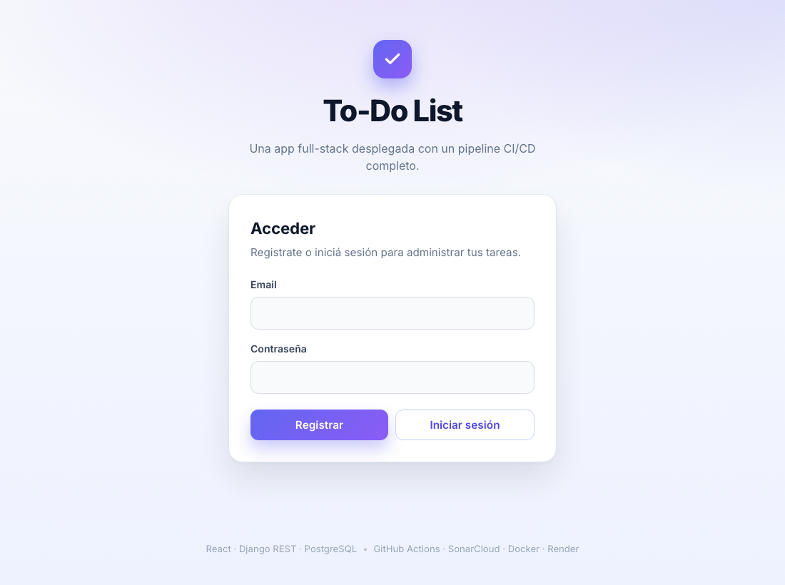
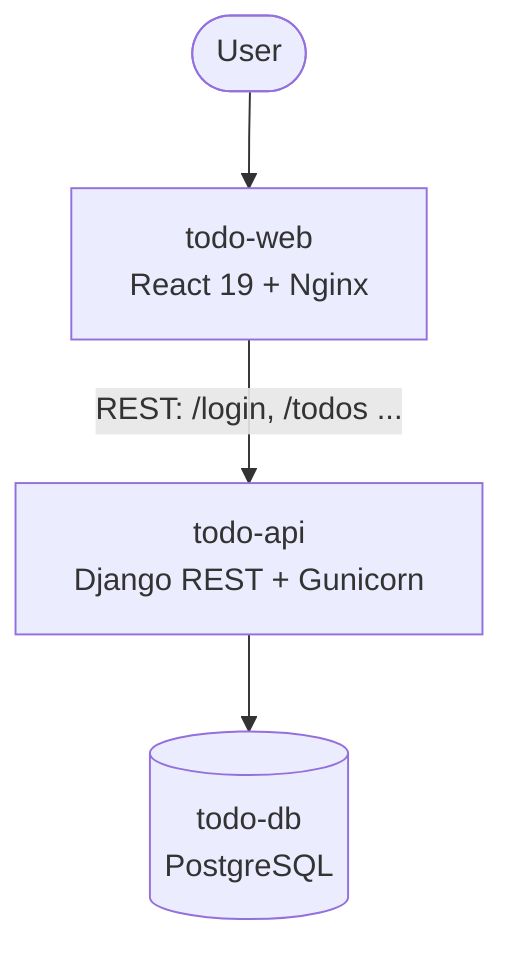
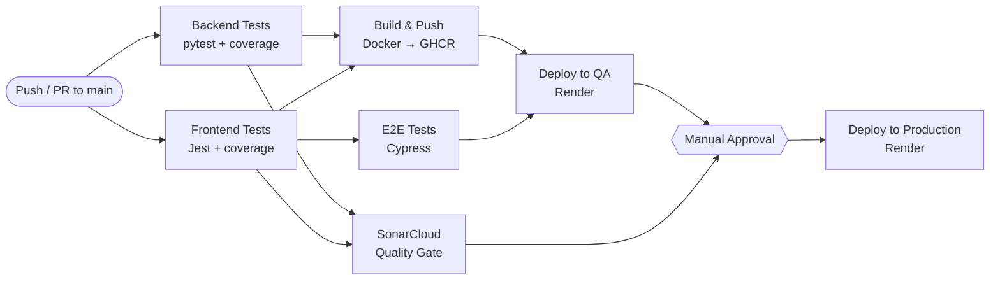

# To-Do List — Full-Stack App with a Complete CI/CD Pipeline

[](https://github.com/Julian0444/CI-CD-on-Full-Stack-Application/actions/workflows/full-ci.yml)
[](https://sonarcloud.io/summary/new_code?id=Julian0444_CI-CD-on-Full-Stack-Application)
[](https://sonarcloud.io/summary/new_code?id=Julian0444_CI-CD-on-Full-Stack-Application)
[](https://sonarcloud.io/summary/new_code?id=Julian0444_CI-CD-on-Full-Stack-Application)

A full-stack to-do application built primarily to **demonstrate a complete CI/CD pipeline** — from automated testing and static analysis with a quality gate, through containerization, all the way to a gated **QA → Production** deployment.



> **The point of this repository is the pipeline, not the to-do app.** The app is a realistic but deliberately simple vehicle to exercise every stage of a modern delivery workflow.

---

## 🔗 Live Demo

| Service | URL |
| ------- | --- |
| **Web app** | https://ci-cd-on-full-stack-application-frontend.onrender.com |
| **API — health check** | https://ci-cd-on-full-stack-application.onrender.com/healthz |
| **API — Swagger docs** | https://ci-cd-on-full-stack-application.onrender.com/api/docs/ |

> ⏳ Hosted on Render's free tier, so the first request after a period of inactivity can take **~50 seconds** to wake the service (cold start). Subsequent requests are fast.

---

## ✨ What this project demonstrates

- **Continuous Integration** — every push and pull request runs the full test suite, measures coverage, and feeds a static-analysis **quality gate**.
- **Continuous Delivery / Deployment** — once the pipeline is green, container images are built and pushed, the app is deployed to **QA**, and promotion to **Production** is guarded by a **manual approval gate**.
- **A real test pyramid** — backend unit/integration tests, frontend unit/component tests, and end-to-end browser tests.
- **Containerization** — multi-stage, non-root Docker images for both the backend and the frontend.
- **12-factor configuration** — environment-driven settings; the same frontend image runs against any backend via runtime config injection.

---

## 🏗️ Architecture



The backend is a **modular monolith** organized by domain, with a clean separation of layers in each app:

```
backend/
├── config/              # Settings per environment (base / local / ci / prod), URLs, WSGI
└── apps/
    ├── health/          # GET /healthz
    ├── users/           # POST /register, POST /login, GET|DELETE /users
    └── todos/           # CRUD /todos, /todos/:id
        ├── domain/      # Domain exceptions
        ├── services/    # Business logic
        ├── repositories/# Data access (ORM)
        ├── api/         # Views, URLs, serializers
        └── tests/       # Tests per layer
```

---

## 🚀 CI/CD Pipeline

Defined in [`.github/workflows/full-ci.yml`](.github/workflows/full-ci.yml) and triggered on every push / pull request to `main`.



| Stage | What it does |
| ----- | ------------ |
| **Backend Tests** | Runs migrations and `pytest` with coverage under an isolated in-memory SQLite config; uploads `coverage.xml` as an artifact. |
| **Frontend Tests** | `npm ci` + Jest with coverage (enforced **70%** threshold); uploads the lcov report as an artifact. |
| **E2E Tests** | Boots the frontend and runs **Cypress** against it (network stubbed with `cy.intercept`), so the suite is deterministic and CI-friendly. |
| **SonarCloud Analysis** | Ingests both coverage reports and runs static analysis; the build **fails if the Quality Gate is red** (bugs, vulnerabilities, coverage on new code, etc.). |
| **Build & Push Images** | Builds multi-stage, non-root Docker images for backend and frontend and pushes them to **GitHub Container Registry (GHCR)**. |
| **Deploy to QA** | Triggers the Render deploy hooks for the QA stage. |
| **Deploy to Production** | Runs only after a **manual approval** (GitHub Environment `prod` with a required reviewer) — modelling controlled promotion. |

**Key practices on display:** parallel jobs, dependency caching (pip & npm), inter-job artifacts, an enforced quality gate, image registry publishing, environment-gated deploys, and a manual promotion gate.

---

## 🧪 Testing Strategy

| Layer | Tooling | Scope |
| ----- | ------- | ----- |
| **Backend unit/integration** | `pytest` + `pytest-django` + `pytest-cov` | Services, repositories and HTTP endpoints (status codes, payloads, validation, error contract). |
| **Frontend unit/component** | `Jest` + React Testing Library | Forms, components, the API client and app-level flows; coverage threshold enforced at 70%. |
| **End-to-end** | `Cypress` | Create / edit / error flows through the real UI. |
| **Static analysis** | `SonarCloud` | Bugs, vulnerabilities, code smells, duplication and coverage — enforced via a **Quality Gate**. |

---

## 🧰 Tech Stack

| Layer | Technology |
| ----- | ---------- |
| **Backend** | Django 4.2 LTS · Django REST Framework · Gunicorn |
| **Frontend** | React 19 · React Scripts · Nginx (runtime) |
| **Database** | PostgreSQL (prod) · SQLite (local / CI) |
| **Testing** | pytest · Jest + React Testing Library · Cypress |
| **CI/CD** | GitHub Actions |
| **Code quality** | SonarCloud (Quality Gate) |
| **Containers / Registry** | Docker (multi-stage) · GitHub Container Registry |
| **Hosting** | Render (web services + managed PostgreSQL) |

---

## 📦 Local Development

### Backend

```bash
cd backend
python3 -m venv .venv && source .venv/bin/activate
pip install -r requirements.txt
cp .env.example .env
DJANGO_SETTINGS_MODULE=config.settings.local python manage.py migrate
DJANGO_SETTINGS_MODULE=config.settings.local python manage.py runserver 8080
```

### Frontend

```bash
cd frontend
npm ci
npm start          # http://localhost:3000
```

### Running the tests

```bash
# Backend
cd backend && source .venv/bin/activate
DJANGO_SETTINGS_MODULE=config.settings.ci python -m pytest --cov --cov-report=term-missing

# Frontend (unit/component)
cd frontend && npx jest --coverage --watchAll=false

# End-to-end
cd frontend && npm run e2e
```

---

## 🔧 Pipeline Configuration

The pipeline degrades gracefully: if an integration's secrets are absent, that stage is **skipped** rather than failing. To enable every stage, configure the following in **Settings → Secrets and variables → Actions**:

| Secret | Used by |
| ------ | ------- |
| `SONAR_TOKEN` | SonarCloud analysis & Quality Gate |
| `RENDER_BACKEND_QA_HOOK` / `RENDER_FRONTEND_QA_HOOK` | Deploy to QA |
| `RENDER_BACKEND_PROD_HOOK` / `RENDER_FRONTEND_PROD_HOOK` | Deploy to Production |

Plus a GitHub **Environment** named `prod` with a *required reviewer* to enable the manual approval gate. (`GITHUB_TOKEN` for GHCR is provided automatically by Actions.)

---

## ⚖️ Design Decisions & Trade-offs

Transparency about deliberate simplifications — and what a production-grade version would change:

- **Shared QA / Production infrastructure.** Because of the Render free tier, both deploy stages target the same services. The pipeline logic is **environment-agnostic**: moving to separate instances only requires pointing the QA/Prod deploy hooks at different services — *no workflow changes*. The QA → manual-approval → Production flow is fully modelled regardless.
- **Deterministic E2E.** Cypress stubs the backend so the suite never flakes on cold starts or network conditions in CI. A production setup would complement this with at least one smoke test against the live deployment.
- **Authentication is intentionally minimal.** This app mirrors the contract of an earlier reference implementation and stores credentials without hashing — acceptable for a demo, **not** for production. A real build would add password hashing and token-based auth.
- **Free-tier cold starts.** Services sleep after inactivity; the first request can take ~50s. A paid tier (or a keep-alive ping) removes this.

> These notes are intentional: understanding *what* to harden for production is part of the skill this project is meant to show.

---

## 📂 Repository Layout

```
.
├── .github/workflows/full-ci.yml   # The CI/CD pipeline
├── backend/                         # Django REST API (modular monolith)
├── frontend/                        # React SPA + Jest + Cypress
├── sonar-project.properties         # SonarCloud configuration
└── docs/                            # Screenshots & assets
```

---

## 📄 License

Released under the MIT License — feel free to use it as a reference.
